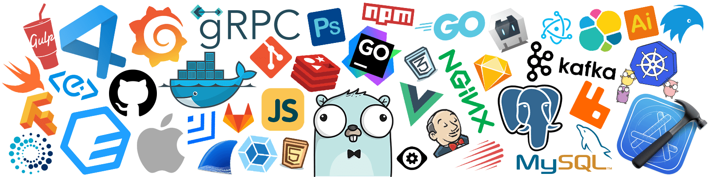
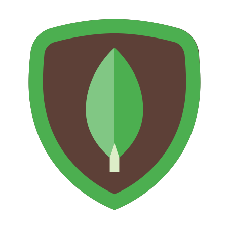

<picture>
    <source media="(prefers-color-scheme: dark)" srcset="icons/header_black.png" />
    
</picture>

<h1 align="center"> Hey! I'm Raiyan Sarker  ! </h1>

<h3 align="center">I'm a Web Developer from Bangladesh 🤍</h3>

Hey there, This is Raiyan, a web developer from Bangladesh. I've been working on frontend and backend development for some time now, along with some experience in Cloud and DevOps. Additionally, I've dabbled in cross-platform app development, which has been pretty exciting. I'm passionate about using technology to solve real-world problems, and I believe programming gives me the tools to do that. I'm also a student, and I try to balance my studies with my work as a developer. I'm always eager to learn new things and collaborate with others to create innovative solutions. I'm not sure about being "brilliant," but I'm certainly hardworking and dedicated.

- 🌱 I’m currently learning Kubernates, AI.
- ⚡ I'm well-versed in Node.js and related frameworks.
- 🚀 Love to do DevOps stuff!
   

## 👨‍💻 Languages and Tools

  

 

 

## 🏆 Github Status

<picture>
  <source width="45%" align="right" media="(prefers-color-scheme: dark)" srcset="https://github-readme-stats.vercel.app/api?username=raiyansarker&show_icons=true&hide_border=true&theme=dark" />
  
</picture>

<picture>
    <source width="45%" media="(prefers-color-scheme: dark)" srcset="https://streak-stats.demolab.com?user=raiyansarker&theme=dark" />
    
</picture>

 

### You can contact me in these medias!

<picture>
  <source media="(prefers-color-scheme: dark)" srcset="https://raw.githubusercontent.com/raiyansarker/raiyansarker/output/github-snake-dark.svg" />
  <source media="(prefers-color-scheme: light)" srcset="https://raw.githubusercontent.com/raiyansarker/raiyansarker/output/github-snake.svg" />
  
</picture>
