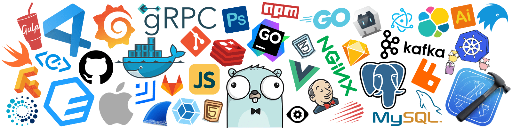

<picture>
    <source media="(prefers-color-scheme: dark)" srcset="icons/header_black.png" />
    
</picture>

<h1 align="center"> Hey! I'm Raiyan Sarker  ! </h1>

<h3 align="center">Full-Stack Web Developer & Cloud Enthusiast from Bangladesh 🤍</h3>

I'm a passionate developer focused on building scalable web applications and robust cloud infrastructure. With hands-on experience across the entire development stack, from crafting intuitive frontends to designing solid backend systems and managing DevOps pipelines, I love using technology to solve real-world problems. 

As a continuous learner, I thrive on exploring new tools, diving into cross-platform development, and tackling complex challenges. My goal is always to create impactful, innovative solutions while growing alongside the tech community.

- 🌍 Based in Bangladesh
- 🌱 Currently exploring **Kubernetes** and **AI/ML**.
- 🧠 Rewiring my brain with pure **Functional Programming** and taming chaos using **EffectTS**! 💥
- ⚡ Deep expertise in **Node.js**, its related frameworks, and building scalable APIs.
- 🚀 Passionate about DevOps, CI/CD, and automating workflows!
- 🤝 Always open to collaborating on innovative ideas and open-source projects.
   

## 👨‍💻 Languages and Tools

  

 

 

## 🏆 Github Status

<picture>
  <source width="45%" align="right" media="(prefers-color-scheme: dark)" srcset="dist/stats-dark.svg" />
  
</picture>

<picture>
  <source width="45%" media="(prefers-color-scheme: dark)" srcset="dist/streak-dark.svg" />
  
</picture>

 

### You can contact me in these medias!

<picture>
  <source media="(prefers-color-scheme: dark)" srcset="dist/github-snake-dark.svg" />
  <source media="(prefers-color-scheme: light)" srcset="dist/github-snake.svg" />
  
</picture>
