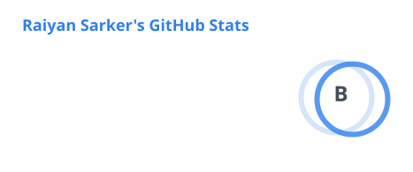
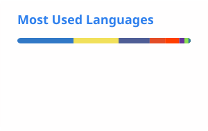

```
    ____        _                      ____             __
   / __ \____ _(_)_  ______ _____     / __/____  _____ / /_____  _____
  / /_/ / __ `/ / / / / __ `/ __ \   \__ \/ __ `/ ___/ //_/ _ \/ ___/
 / _, _/ /_/ / / /_/ / /_/ / / / /  ___/ / /_/ / /  / ,< /  __/ /
/_/ |_|\__,_/_/\__, /\__,_/_/ /_/  /____/\__,_/_/  /_/|_|\___/_/
              /____/
```

<div align="center">

**`Full-Stack Developer • Cloud Architect • Open-Source Enthusiast`**

[](https://raiyansarker.com?utm_source=github&utm_medium=profile)
[](https://raiyansarker.com/linkedin?utm_source=github&utm_medium=profile)
[](https://raiyansarker.com/instagram?utm_source=github&utm_medium=profile)
[](https://raiyansarker.com/facebook?utm_source=github&utm_medium=profile)

</div>

---

### `> neofetch`

```properties
raiyan@earth
─────────────
OS        ~ Bangladesh 🇧🇩
Role      ~ Full-Stack Web Developer
Shell     ~ TypeScript, Go, Rust, Python
Uptime    ~ Building things since forever
Focus     ~ Scalable web apps & cloud infra

Currently ~ Exploring Kubernetes & AI/ML
           ~ Rewiring brain with FP & EffectTS
Motto     ~ "Automate everything, learn anything"
```

---

### `> ls ./skills`

```
📂 Languages
├── TypeScript  ████████████████████░░░  90%
├── JavaScript  ████████████████████░░░  85%
├── Python      ██████████████████░░░░░  75%
├── Go          ███████████████░░░░░░░░  65%
├── Rust        ██████████████░░░░░░░░░  60%
└── PHP         ████████████░░░░░░░░░░░  50%
```

```
📂 Frontend
├── React / Next.js     ████████████████████░░░  90%
├── Svelte / SvelteKit  ██████████████████░░░░░  75%
└── Tailwind CSS        ████████████████████░░░  85%
```

```
📂 Backend & Infra
├── Node.js         ████████████████████░░░  90%
├── Docker          ██████████████████░░░░░  80%
├── Kubernetes      ██████████████░░░░░░░░░  60%
├── PostgreSQL      ██████████████████░░░░░  75%
├── MongoDB         ██████████████████░░░░░  75%
├── AWS             ██████████████████░░░░░  70%
├── Cloudflare      ██████████████████░░░░░  75%
└── Firebase        ████████████████░░░░░░░  65%
```

---

### `> cat ./stats.md`

<picture>
  <source width="48%" align="right" media="(prefers-color-scheme: dark)" srcset="dist/stats-dark.svg" />
  
</picture>

<picture>
  <source width="48%" media="(prefers-color-scheme: dark)" srcset="dist/streak-dark.svg" />
  
</picture>

<br clear="both">

<div align="center">
<picture>
  <source width="60%" media="(prefers-color-scheme: dark)" srcset="dist/top-langs-dark.svg" />
  
</picture>
</div>

---

### `> cat ./about.md`

```
I build things for the web — from pixel-perfect frontends to
battle-tested APIs and the infrastructure that holds it all
together. I care about developer experience, clean architecture,
and shipping software that actually works.

When I'm not coding, I'm probably diving into a new tool,
reading about distributed systems, or contributing to
open-source projects.
```

---

<div align="center">

### `> ./connect.sh`

```bash
#!/bin/bash
# Let's build something cool together 🚀

echo "Open to collaborations, ideas, and conversations!"
echo ""
echo "📧  Email    → hello@raiyansarker.com"
echo "🌐  Website  → raiyansarker.com"
echo "💼  LinkedIn → /in/raiyansarker"
```

<br>

<picture>
  <source media="(prefers-color-scheme: dark)" srcset="dist/github-snake-dark.svg" />
  <source media="(prefers-color-scheme: light)" srcset="dist/github-snake.svg" />
  
</picture>

<sub>⚡ This README auto-updates daily via GitHub Actions</sub>

</div>
